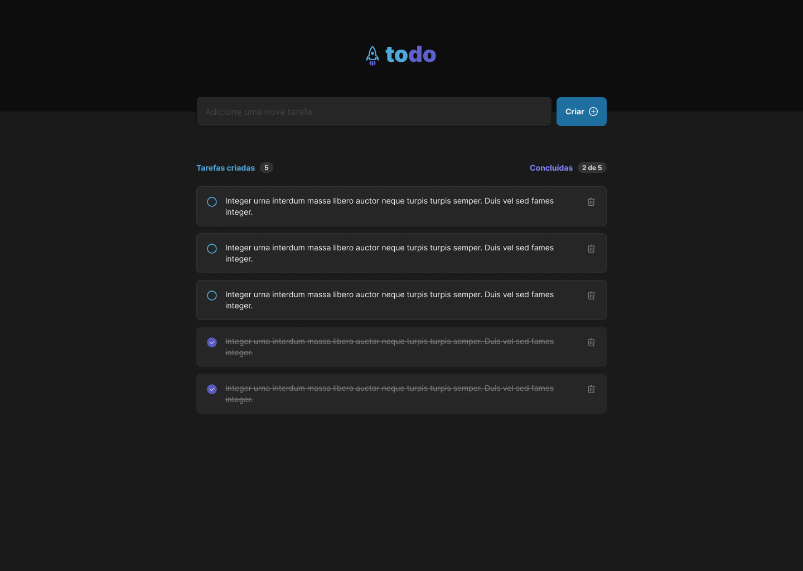
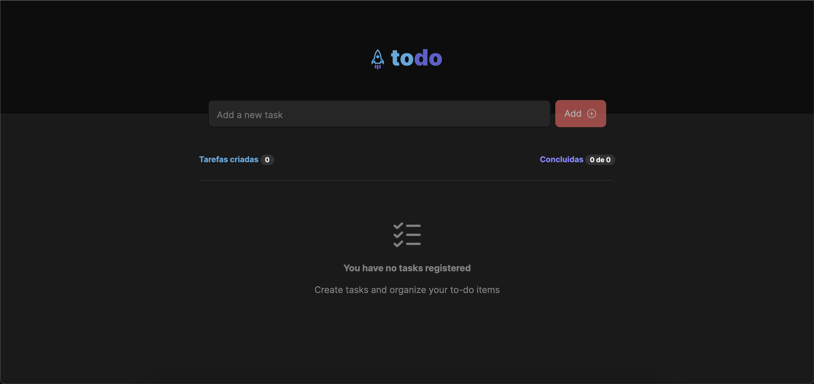

# Desktop

### Todo Preview

<h1 display = "flex" align-items = "center">
    
</h1>

### Empty Todo Preview

<h1 display = "flex" align-items = "center">
    
</h1>

<br>

## 🧪 Technologies

This project was developed using the following technologies:

- [ReactJS](https://reactjs.org/)
- [Date-fns](https://date-fns.org/)
- [Phosphor Icons](https://phosphoricons.com/)

## 🚀 Getting started

Clone the project and access the folder.

```bash
git clone https://github.com/AOBarbosa/Ignite-Feed-TS.git

cd Ignite-Feed-TS

```

Run this command to install the dependencies.

```bash
npm i

npm run dev
```

## 🔖 Layout

You can view the project through the links below:

- [Figma](<https://www.figma.com/file/7FMmtXDzzVFc4OONuc4884/Ignite-Feed-(Community)?node-id=0%3A1&t=lltpgIpxVkF2wX6f-1>)

Remembering that you need to have a [Figma](http://figma.com/) account to access it.
